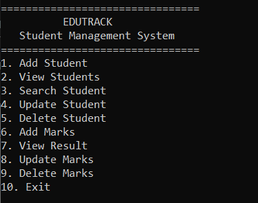
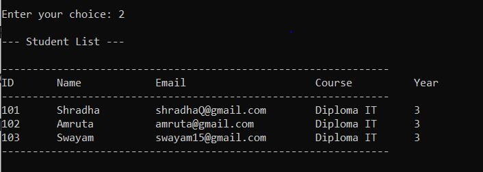
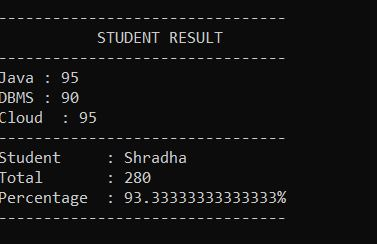

# EduTrack – Student Academic Management System

EduTrack is a Java-based Student Academic Management System developed using Core Java, JDBC, and MySQL.

The project allows users to manage student information and academic marks through a simple menu-driven application.

## Features

### Student Management
- Add Student
- View All Students
- Search Student
- Update Student
- Delete Student

### Marks Management
- Add Marks
- View Student Result
- Update Marks
- Delete Marks
- Marks validation from 0 to 100

## Technologies Used

- Java
- Core Java
- OOP Concepts
- JDBC
- MySQL
- SQL
- PreparedStatement
- ResultSet
- Git
- GitHub

## Database

Database Name:

`edutrack_db`

### Students Table

Stores student information such as:

- Student ID
- Name
- Email
- Phone
- Course
- Year

### Marks Table

Stores:

- Mark ID
- Student ID
- Subject
- Marks

The `marks` table is connected to the `students` table using a foreign key.

## Project Structure

```text
EduTrack/
│
├── Main.java
├── Student.java
├── StudentDAO.java
├── Marks.java
├── MarksDAO.java
├── TestConnection.java
├── DBConnection.java.example
├── mysql-connector-j-26.7.0.jar
├── .gitignore
└── README.md

How the Project Works
User
  ↓
Main Menu
  ↓
Student / Marks Operations
  ↓
DAO Classes
  ↓
JDBC
  ↓
MySQL Database
JDBC Connection

The project uses JDBC to connect Java with MySQL.

PreparedStatement is used for database operations to safely pass user input to SQL queries.

How to Run
1. Install Requirements
Java JDK
MySQL Server
MySQL Workbench
MySQL Connector/J
2. Create Database

Create the database:

CREATE DATABASE edutrack_db;

Select the database:

USE edutrack_db;

Create the students table:

CREATE TABLE students
(
    id INT PRIMARY KEY,
    name VARCHAR(50),
    email VARCHAR(100),
    phone VARCHAR(15),
    course VARCHAR(50),
    year INT
);

Create the marks table:

CREATE TABLE marks
(
    mark_id INT AUTO_INCREMENT PRIMARY KEY,
    student_id INT,
    subject VARCHAR(50),
    marks INT,
    FOREIGN KEY (student_id) REFERENCES students(id)
);
3. Configure Database Connection

Copy:

DBConnection.java.example

and rename the copy to:

DBConnection.java

Open DBConnection.java and replace:

YOUR_PASSWORD

with your own MySQL root password.

4. Compile the Project

Open CMD inside the project folder and run:

javac -cp ".;mysql-connector-j-26.7.0.jar" *.java
5. Run the Project
java -cp ".;mysql-connector-j-26.7.0.jar" Main
Important

The actual DBConnection.java file is not included in this repository because it contains database credentials.

Use DBConnection.java.example as the template.

Learning Outcomes

## Screenshots

### Main Menu



### View Students



### View Result



Core Java
Object-Oriented Programming
JDBC
SQL
CRUD Operations
PreparedStatement
ResultSet
SQL JOIN
Exception Handling
DAO Architecture
Git and GitHub
Future Improvements
GUI using Java Swing
Login system
Admin dashboard
Attendance management
Student profile management
Export results to PDF
Maven project structure
Author

Shradha Salokhe

Diploma in Information Technology